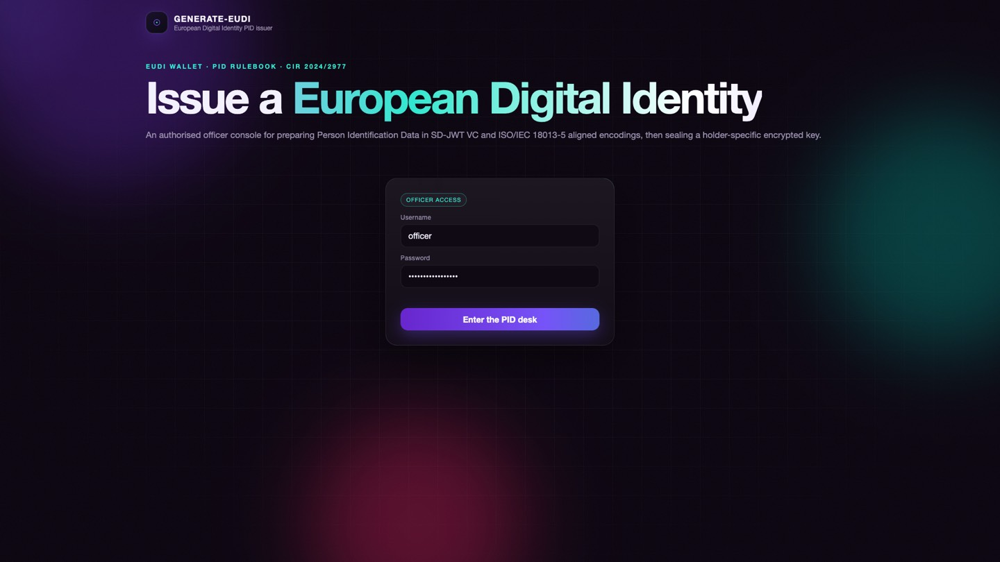
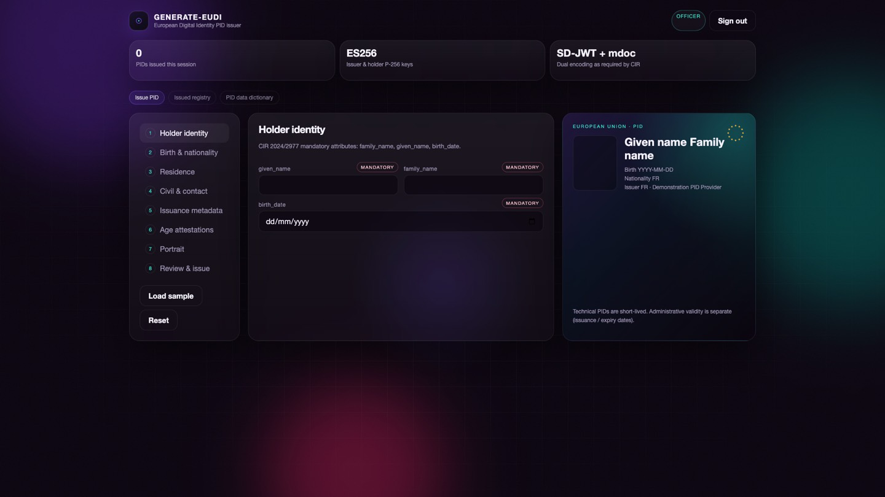
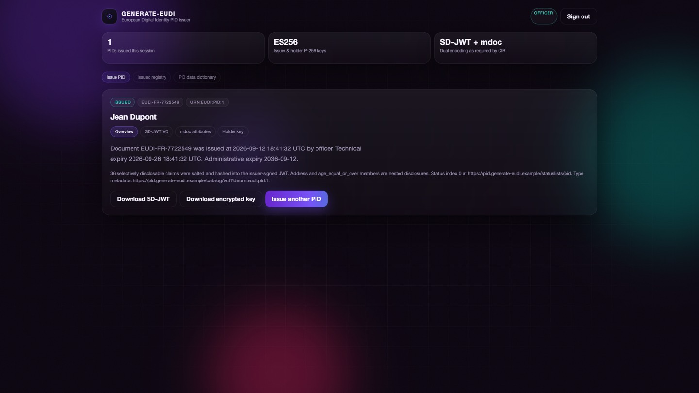
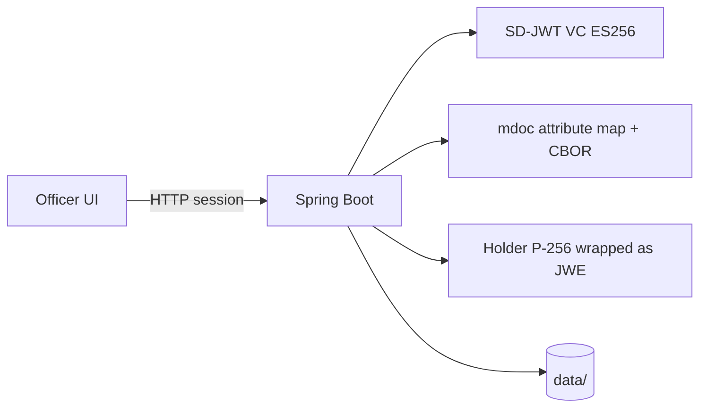

# generate-eudi

Reference **Person Identification Data (PID)** issuer for the [European Digital Identity Wallet](https://ec.europa.eu/digital-building-blocks/sites/display/EUDIGITALIDENTITYWALLET/EU+Digital+Identity+Wallet+Home). Authorised officers fill CIR / ARF PID fields in English; the service returns:

- an **SD-JWT VC** (`vct`: `urn:eudi:pid:1`) with salted selective disclosures
- an **ISO/IEC 18013-5 aligned** attribute map (`docType` / namespace `eu.europa.ec.eudi.pid.1`) plus CBOR
- a **holder-specific P-256 key** bound in `cnf.jwk`, with the private JWK wrapped as **JWE** (`dir` + `A256GCM`)

This is a demonstration desk, not a notified PID Provider and not a production EUDI Wallet. It is free software, provided **AS IS**, with **no warranty** and **no liability** for bugs, data loss, or misuse (see [Licenses](#licenses)).

## Standards covered

| Source | What this sample implements |
| --- | --- |
| Regulation (EU) 2024/1183 | PID as the high-assurance identity attestation in the Wallet |
| CIR (EU) 2024/2977 | Mandatory/optional PID attributes and metadata |
| ARF Annex 3.01 PID Rulebook | SD-JWT claim names, mdoc identifiers, `place_of_birth`, age attestations, `trust_anchor`, `attestation_legal_category` |
| ISO/IEC 18013-5 | Namespace/docType `eu.europa.ec.eudi.pid.1` and attribute encoding (MSO/COSE is documented as out of scope for this sample) |
| SD-JWT VC | Issuer-signed JWT + `~` disclosures, `cnf` key binding, short technical validity |

Legal-person PID is out of scope of the natural-person PID Rulebook and of this sample.

## Run

Requires **Java 21** and **Maven 3.9+**.

```bash
mvn spring-boot:run
```

Open [http://127.0.0.1:8080](http://127.0.0.1:8080) (prefer `127.0.0.1` over `localhost` — some IDEs intercept `localhost:8080`).

Test coverage (JaCoCo HTML report at `target/site/jacoco/index.html`):

```bash
mvn test
```

Demo officer credentials (change before any non-local use):

- Username: `officer`
- Password: `eudi-officer-2026`

## Screenshots

The officer UI is a static page at `/`. Sign in, fill CIR/ARF fields (or load the built-in sample), then issue.

### Sign-in

The homepage shows the officer form. Demo credentials are already filled in.



### Officer desk

After sign-in, **Issue PID** shows the field list on the left, the current section in the centre, and a live **European Union · PID** preview on the right. Tabs also open the issued registry and the PID data dictionary.



### Issued PID

A successful issue shows the holder name, document number, technical and administrative expiry, and downloads for the SD-JWT and the encrypted holder key. The recovery secret is shown only on this first response, on the **Holder key** tab.



## How it works

This is a **single Spring Boot 3 process** (Java 21) that serves a static officer UI and a JSON API. There is no separate frontend stack, no wallet app, and no verifier. A session-authenticated officer submits CIR/ARF fields; the server validates them, derives age attestations, and emits **two encodings of the same PID** plus a holder key.



### Runtime stack

| Layer | Choice |
| --- | --- |
| Language / runtime | Java 21 |
| App framework | Spring Boot 3.5, Spring Security (in-memory officer, HTTP session), Spring Validation |
| Logging | Log4j2 (Logback is excluded) |
| JOSE / JWT | Nimbus JOSE JWT — SD-JWT signing, JWE wrap/unwrap, JWKS |
| Binary encoding | Jackson CBOR (`jackson-dataformat-cbor`) |
| UI | Static HTML / CSS / JS under `src/main/resources/static/` |
| Persistence | JSON files under `data/` (not a SQL database) |

No machine-learning models are used. “Model” here means **cryptographic algorithms and credential formats**.

### Cryptographic algorithms and credential formats

| What | Algorithm / format | Where it is used |
| --- | --- | --- |
| Issuer signature | **ES256** (ECDSA with SHA-256 on curve **P-256** / secp256r1) | SD-JWT `alg`, JWT `typ: vc+sd-jwt` |
| Holder binding key | **EC P-256** key pair | Public JWK in SD-JWT `cnf.jwk`; private JWK never placed in the JWT |
| Holder private-key wrap | **JWE** `alg: dir`, `enc: A256GCM` | AES-256-GCM over the holder JWK; wrapping key shown once as the recovery secret |
| Selective disclosure | **SD-JWT VC** (`vct`: `urn:eudi:pid:1`), disclosures hashed with **SHA-256** (`_sd_alg`) | Salted `~` disclosures for claims; nested `_sd` for `address.*`, `place_of_birth.*`, `age_equal_or_over.*` |
| mdoc encoding | ISO/IEC 18013-5 **namespace / docType** `eu.europa.ec.eudi.pid.1`, attributes as **CBOR** | Teaching-grade attribute map only — no MSO / COSE_Sign1 yet |
| Portrait | JPEG bytes | mdoc `portrait` as `bstr-base64` (empty on opt-out); SD-JWT `picture` as a JPEG data URL |
| Revocation | IETF **Token Status List** (1 bit per PID, zlib + base64url) | `status.status_list` in the SD-JWT; public list at `/statuslists/pid` |
| Password hashing | **BCrypt** | Officer password in Spring Security |
| Key identifiers | JWK `kid` | Issuer key file + JWKS at `/.well-known/jwt-vc-issuer` |

Two validity windows exist on purpose: administrative `issuance_date` / `expiry_date` (default ten years) and a short technical JWT `exp` (default 14 days, `eudi.technical-validity-days`).

The holder PID private key must not be used to sign transactional data (PID Rulebook §5). It only binds the credential to a key (`cnf`).

### Issuance pipeline

`POST /api/pid` runs `PidIssuanceService.issue`:

1. Authenticate the officer (session).
2. Validate CIR/ARF fields (ISO country codes, sex vocabulary 0/1/2/3/4/5/6/9, JPEG portrait or PID_03 opt-out, jurisdiction prefix, at least one `place_of_birth` member).
3. Build a `PidDocument`. Derive `age_in_years`, `age_birth_year`, and `age_equal_or_over.{12,14,16,18,21,65}` from `birth_date`.
4. Generate an EC P-256 holder key. Put only the public JWK in `cnf`. Wrap the private JWK as JWE; return the wrapping key **once**.
5. Hash salted disclosures, sign the SD-JWT with the issuer P-256 key (**ES256**). The issuer JWK is added on first run at `data/issuer-ec-p256.jwk.json`.
6. Encode the same document as an mdoc-aligned map and CBOR hex.
7. Allocate a Token Status List index, persist the artefacts, append an `ISSUE` audit row.

Unlock (`POST /api/pid/{id}/unlock`) decrypts the JWE with the recovery secret. Revoke flips the status-list bit for that index.

### What is stored

| Path | Content |
| --- | --- |
| `data/issuer-ec-p256.jwk.json` | Issuer ES256 key (includes private `d`) |
| `data/issued-pids.json` | Issued SD-JWT, mdoc, JWE — **not** the recovery secret |
| `data/audit-log.json` | Officer `ISSUE` / `REVOKE` events |

Public metadata: VCT type catalogue at `/catalog/vct?id=urn:eudi:pid:1`, issuer JWKS at `/.well-known/jwt-vc-issuer`.

## PID fields

The in-app **PID data dictionary** lists every identifier with its SD-JWT claim and mdoc attribute. The HTTP equivalent is `GET /api/pid/schema` (officer session required).

Mandatory CIR attributes: `family_name`, `given_name`, `birth_date`, `birth_place`, `nationality`, plus metadata `issuing_authority` and `issuing_country`. Portrait is required unless the holder opts out.

## API (officer session)

| Method | Path | Purpose |
| --- | --- | --- |
| POST | `/api/auth/login` | Add officer session |
| GET | `/api/pid/schema` | Full PID field catalogue |
| POST | `/api/pid` | Issue PID + encrypted holder key |
| GET | `/api/pid` | Session registry |
| GET | `/api/pid/{id}` | Issued artefacts (recovery secret is not stored) |
| GET | `/api/pid/audit` | Officer audit log |
| POST | `/api/pid/{id}/unlock` | Unwrap holder JWK with the recovery secret |
| POST | `/api/pid/{id}/revoke` | Set Token Status List bit to revoked |

Public: `GET /api/health`, `GET /api/meta`, `GET /catalog/vct?id=urn:eudi:pid:1`, `GET /.well-known/jwt-vc-issuer`, `GET /statuslists/pid`.

## Licenses

This repository is licensed under the **[Apache License 2.0](LICENSE)** (copyright 2026 nordlyse). That is the right licence for this project: it is free to use, copy, and modify, and it states that the software is delivered **AS IS**, without warranties of any kind, and that contributors are **not liable** for damages arising from use (Apache 2.0 §§ 7–8). Nobody is entitled to treat this desk as a certified PID Provider or to hold the authors responsible if issuance, crypto, or UI behaviour is wrong.

Use it only as a reference / teaching sample. You assume all risk.

Third-party licences below are those of the libraries this build actually pulls in (Maven, Spring Boot 3.5.5 BOM). Java 21 and Maven themselves are not redistributed.

### Runtime (shipped with `mvn spring-boot:run`)

| Component | Licence |
| --- | --- |
| Spring Boot 3.5, Spring Framework 6.2, Spring Security 6.5, Spring Web / WebMVC | Apache-2.0 |
| Apache Tomcat Embed 10.1 (core, EL, WebSocket) | Apache-2.0 |
| Jackson 2.19 (core, databind, annotations, JDK8, JSR-310, parameter-names, **CBOR**) | Apache-2.0 |
| Apache Log4j2 2.24 | Apache-2.0 |
| SLF4J API 2.0 | MIT |
| SnakeYAML 2.4 | Apache-2.0 |
| Micrometer Observation / Commons 1.15 | Apache-2.0 |
| Hibernate Validator 8.0 | Apache-2.0 |
| Jakarta Bean Validation API 3.0 | Apache-2.0 |
| JBoss Logging, ClassMate | Apache-2.0 |
| Nimbus JOSE JWT 10.4.2 | Apache-2.0 |
| Jakarta Annotations API 2.1 | **EPL-2.0** or GPL-2.0-with-classpath-exception (dual) |

### Test and coverage only (not required to issue a PID)

| Component | Licence |
| --- | --- |
| JUnit Jupiter 5 / JUnit Platform | EPL-2.0 |
| JaCoCo 0.8 (Maven plugin) | EPL-2.0 |
| Mockito 5 | MIT |
| AssertJ, Awaitility, Byte Buddy, Objenesis, ApiGuardian, OpenTest4J, XMLUnit, JSONAssert, JSON Path, json-smart | Apache-2.0 |
| Hamcrest 3 | BSD-3-Clause |
| OW2 ASM | BSD-3-Clause |
| Jakarta XML Binding API, Jakarta Activation API | Eclipse Distribution License 1.0 (BSD-3-style) |
| Vaadin `android-json` (JSONAssert transitive) | Apache-2.0 |
| Maven Surefire plugin | Apache-2.0 |

The officer UI is static HTML/CSS/JS in this repo (system fonts only; no Google Fonts).

Full Apache 2.0 text: [`LICENSE`](LICENSE). Third-party notices: [`NOTICE`](NOTICE).

## Configuration

See `src/main/resources/application.yml` (`eudi.issuer`, `eudi.vct`, officer credentials, technical validity window).

## Roadmap — what is done, what comes next

This sample already covers **natural-person PID data fields** and a teaching-grade SD-JWT. It does **not** yet produce a legally recognised PID or a Wallet Unit. Work is split into stages so later sessions can pick up one stage at a time.

Legal-person PID (company / public body identity) is **not** a missing field on this form. It is a separate attestation type with a different rulebook. It is listed as its own track at the end.

The PID holder key must never be used to sign transactional data (PID Rulebook §5). That stays true in every stage.

### Stage 0 — done 

Officer desk for a natural-person PID:

- [x] CIR 2024/2977 + ARF PID Rulebook attributes and metadata in the UI and API
- [x] Age claims derived from `birth_date` (`age_in_years`, `age_birth_year`, `age_equal_or_over.{12,14,16,18,21,65}`)
- [x] SD-JWT VC (`vct`: `urn:eudi:pid:1`) with salted disclosures, `cnf.jwk`, short technical validity
- [x] mdoc-aligned attribute map (`eu.europa.ec.eudi.pid.1`) plus CBOR hex — **attributes only**, not a full mdoc
- [x] Server-generated P-256 holder key, public JWK in `cnf`, private JWK wrapped as JWE
- [x] Officer login (persistence added in Stage 1)

### Stage 1 — done (`stage-1` branch) 

Officer desk improvements to the issued artefact:

- [x] Nested selective disclosure for `address.*`, `place_of_birth.*`, and `age_equal_or_over.NN`
- [x] JPEG-only portrait; mdoc `portrait` is raw JPEG bytes as `bstr-base64` (empty on PID_03 opt-out); SD-JWT `picture` stays a JPEG data URL
- [x] SD-JWT `status.status_list` (IETF Token Status List) published at `/statuslists/pid`; officer revoke updates the list
- [x] `vct` type metadata at `/catalog/vct?id=urn:eudi:pid:1` and issuer JWKS at `/.well-known/jwt-vc-issuer` (PID_15)
- [x] Issued PIDs persist under `data/issued-pids.json`; officer audit log under `data/audit-log.json`

### Stage 2 — complete the ISO/IEC 18013-5 mdoc 

CIR requires PID in **both** SD-JWT VC and mdoc. Stage 0 only maps attributes.

1. Build a real mdoc: per-element digests, Mobile Security Object (MSO), `IssuerAuth` as **COSE_Sign1**.
2. Put the holder device key in the MSO; keep namespace / `docType` `eu.europa.ec.eudi.pid.1`.
3. Encode dates as `full-date` / `tdate` per the PID Rulebook CDDL, not only ISO date strings in JSON.
4. Optional later: proximity session encryption (NFC / BLE DeviceEngagement). Needed for a phone presentation demo, not for “file on disk” issuance.

### Stage 3 — holder key is born in a wallet, not on the server 

Today the server generates the holder key and shows a recovery secret. In EUDI the key is generated in the Wallet Secure Cryptographic Device (WSCD).

1. Add a minimal holder/wallet page that generates P-256 **in the browser** (or a stub WSCD) and never sends `d` to the issuer.
2. Wallet sends the public JWK plus **proof of possession** to the officer/issuer API.
3. Issuer binds that public key in `cnf` / MSO deviceKey and does not wrap a server-side private key.
4. Keep the rule: this key is only for PID key binding, not for signing contracts or payments.

### Stage 4 — issue into the wallet (OpenID4VCI) 

A PID is issued when it arrives in a Wallet Unit, not when an officer downloads a file.

1. Implement OpenID4VCI credential offer + credential endpoint (pre-authorized or authorized code flow).
2. Wallet pulls the SD-JWT (and later the mdoc) over that protocol.
3. During the administrative validity period, re-issue short-lived **technical** PIDs without asking the user again (ARF distinction vs `expiry_date` / `issuance_date`).

### Stage 5 — identity proofing and issuer trust 

Without this, the credential is still a demo even if Stages 1–4 are complete.

1. Bind issuance to a real identity source (civil register, notified eID, or a documented high-assurance proofing stub). Officer typing is not LoA high.
2. Issuer signing key in an HSM (or documented software-HSM stub); publish the public key as a machine-readable trust anchor.
3. Align `iss` / trust anchor with how CIR 2024/2980 trusted lists work (even if the key is not on the real EU list).
4. Revocation workflow: officer revoke → status list / MSO updates → relying party can check.

### Stage 6 — presentation and relying party (optional, but needed to prove issuance) 

Issuance is only proven when someone can verify a presentation.

1. Demo relying-party verifier for SD-JWT (and mdoc if Stage 2 is done): check issuer signature, `cnf` / KB-JWT, expiry, status.
2. Selective disclosure UI in the wallet: e.g. share `age_equal_or_over.18` without `birthdate`.
3. Do not use the PID private key to sign transactional payloads from the relying party.

### Stage 7 — production EUDI Wallet Unit (out of this sample’s original scope) 

Only after Stages 3–6. This is a certified product, not a README checkbox:

- WSCD / hardware-backed keys
- OpenID4VP + ISO 18013-5 proximity
- QEAA / Pub-EAA besides PID
- Unlinkability, consent, RP authentication
- Wallet and PID Provider certification / Member State notification

This repository will not become a notified Wallet or PID Provider by completing Stages 1–6 alone.

### Separate track — legal-person identification data 

Not part of the natural-person PID form.

1. New rulebook / attribute set (legal name, registration number, VAT, seat, representative, …).
2. Separate `vct` / mdoc namespace from `urn:eudi:pid:1`.
3. Reuse Stages 1–6 patterns (dual encoding, wallet key, OpenID4VCI, trusted issuer) on that type.

### Suggested order of work

| Status | Stage | Outcome |
| --- | --- | --- |
|  | Stage 0 | Officer desk, CIR/ARF fields, teaching SD-JWT |
|  | Stage 1 | Nested SD, JPEG portrait, status list, VCT catalog, persistence |
|  | Stage 2 | Verifiable mdoc file, not only a CBOR attribute map |
|  | Stage 3 + 4 | Key in a demo wallet; credential delivered by OpenID4VCI |
|  | Stage 5 + 6 | Proofing/trust stub + a verifier that accepts a presentation |
|  | Stage 7 / legal person | Only if the goal is a Wallet product or organisation identity |
